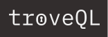

<div align="center">
  
  <h1>TroveQL DEMO APP</h1>
  <p>TroveQL Demo is a simple web app with a GraphQL API on its Express.js server using the TroveQL cache library to showcase TroveQL and its performance metrics desktop application, TroveMetrics, in action.</p>
  
  
  
  
  
  
  
  
  
  
  
  
  
  
</div>

## Get Started
#### Clone this repository
```bash
git clone https://github.com/oslabs-beta/troveql-demo.git
```
#### Set up a PostgreSQL database using ElephantSQL
1. Go to [ElephantSQL](https://www.elephantsql.com/), sign in or register for an account, and create a new database instance. Select the free tier as 'Tiny Turtle'. The instance's name and datacenter are up to you.
2. Copy your new database instance's URL from the DETAILS tab.
3. Check that you have [PostgresQL](https://www.postgresql.org/download/) installed. You can run `psql --version` on your command line to check.

#### Set up your .env file
1. From the root directory of the Demo App, navigate to the /server folder.
2. Create a .env file in the server directory and add the following:
```javascript
PG_URI=//insert your postgresql URI here
``` 

#### Download TroveMetrics
Now go to the <a href="https://www.troveql.io/" target="_blank" rel="noopener noreferrer">TroveQL website</a> and download the desktop application for your OS (macOS, Windows, Linux).

#### Run the demo
1. Open your downloaded TroveMetrics desktop application.
2. Next, install all the dependencies for the Demo App by running `npm run prestart` on your command line in the root folder.
3. Finally, run `npm start` from the root directory to start the Demo App on http://localhost:8080/.
4. Click around and see the TroveQL cache in action from TroveMetrics! (NOTE: If you are seeing proxy errors from Vite in your terminal, try running `killall node` on your command line before running `npm start` again.)

#### (Optional) Configure your instance of TroveQL
In the index.ts file in the /server folder, you can customize your TroveQL cache configuration:
```javascript
const capacity = 5; // size limit of your cache
const graphQLAPI = 'http://localhost:4000/graphql'; // your GraphQL URL endpoint
const useTroveMetrics = true; // (optional) if you would like to use TroveMetrics - default is false
const mutations = {}; // (optional) object where key/value pairs are mutation types/object types mutated (ex. { addMovie: 'movie', editMovie: 'movie', deleteMovie: 'movie' })
const cache = new TroveQLCache(capacity, graphQLAPI, useTroveMetrics, mutations);
```
To learn more about TroveQL's cache configruation options, visit <a href="https://github.com/oslabs-beta/troveql">TroveQL's GitHub page</a>.

## Learn More
Visit the <a target="_blank" rel="noopener noreferrer" href="https://www.troveql.io/">TroveQL website</a> to get more information and watch a video demo of TroveQL and TroveMetrics.

Thank you so much!

## Authors
Alex Klein - [GitHub](https://github.com/a-t-klein) | [LinkedIn](https://www.linkedin.com/in/alex-t-klein-183aa758/)
<br>
Erika Jung - [GitHub](https://github.com/erikahjung) | [LinkedIn](https://www.linkedin.com/in/erikahjung)
<br>
Sam Henderson - [GitHub](https://github.com/samhhenderson) | [LinkedIn](https://www.linkedin.com/in/samuel-h-henderson/)
<br>
Tricia Yeh - [GitHub](https://github.com/triciacorwin) | [LinkedIn](https://www.linkedin.com/in/tricia-yeh/)
<br>